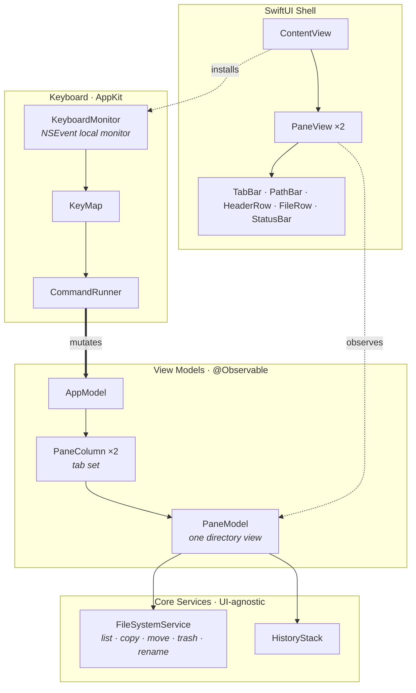

<p align="center">
  
</p>

# Macmd

A native macOS **dual-pane file manager** in the spirit of Total Commander —
keyboard-driven, orthodox-file-manager style.

## Features

- **Dual-pane** layout; `←` / `→` switch panes
- **Multi-tab per pane**: `⌘T` opens a tab at the current path, `Tab` cycles tabs
- **Keyboard navigation**: `↑↓` move cursor, `↵` enter, `⌫` / `⌘↑` go up
- **Multi-select** (`Space`) and **type-ahead filter** (substring match, anywhere in the name)
- **File ops**: `F5`/`⌘C` copy, `F6` move, `⌘⌫` trash (`⌥⌘⌫` permanent), `F7` new folder, `F2` / click-name inline rename
- **Column sorting**, hidden-file toggle (`⌘.`), back/forward history, bookmarks (`⌘D`)

Shortcuts are Mac-native first (`⌘C`/`⌘V`/`⌘⌫`), with Total Commander F-keys as aliases.

## Architecture

A layered, UI-agnostic core keeps the logic unit-testable; keyboard input is
handled at the AppKit level and routed through a command registry, so bindings
are fully decoupled from actions.



**Layers**

- `FileSystemService` — list / copy / move / trash / rename (Foundation)
- `PaneModel` — one directory view: entries, cursor, selection, sort, filter, history, inline rename
- `PaneColumn` — a pane's set of tabs
- `AppModel` — the two panes, active side, bookmarks, status
- `KeyMap` + `CommandRunner` — key bindings decoupled from actions
- `KeyboardMonitor` — app-wide `NSEvent` keyDown routing (bypasses flaky SwiftUI focus)
- SwiftUI shell — `ContentView` / `PaneView` / `TabBar` / …

## Build & run

```sh
swift build
swift run          # or package Macmd.app and open it
```

## Test

```sh
swift test
```

Requires macOS 14+ and a Swift 6 toolchain.
